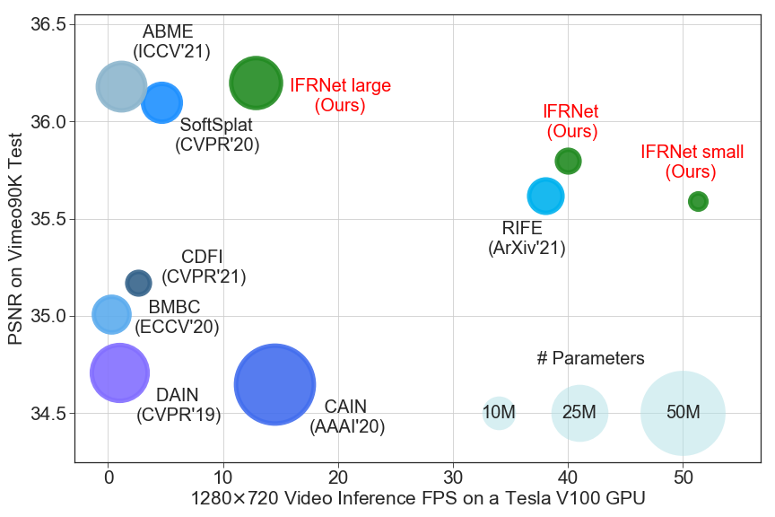

# IFRNet: Intermediate Feature Refine Network for Efficient Frame Interpolation
The official PyTorch implementation of IFRNet (CVPR 2022).

## Abstract
Prevailing video frame interpolation algorithms, that generate the intermediate frames from consecutive inputs, typically rely on complex model architectures with heavy parameters or large delay, hindering them from diverse real-time applications. In this work, we devise an efficient encoder-decoder based network, termed IFRNet, for fast intermediate frame synthesizing. It first extracts pyramid features from given inputs, and then refines the bilateral intermediate flow fields together with a powerful intermediate feature until generating the desired output. The gradually refined intermediate feature can not only facilitate intermediate flow estimation, but also compensate for contextual details, making IFRNet do not need additional synthesis or refinement module. To fully release its potential, we further propose a novel task-oriented optical flow distillation loss to focus on learning the useful teacher knowledge towards frame synthesizing. Meanwhile, a new geometry consistency regularization term is imposed on the gradually refined intermediate features to keep better structure layout. Experiments on various benchmarks demonstrate the excellent performance and fast inference speed of proposed approaches. Code is available at [https://github.com/ltkong218/IFRNet](https://github.com/ltkong218/IFRNet).
